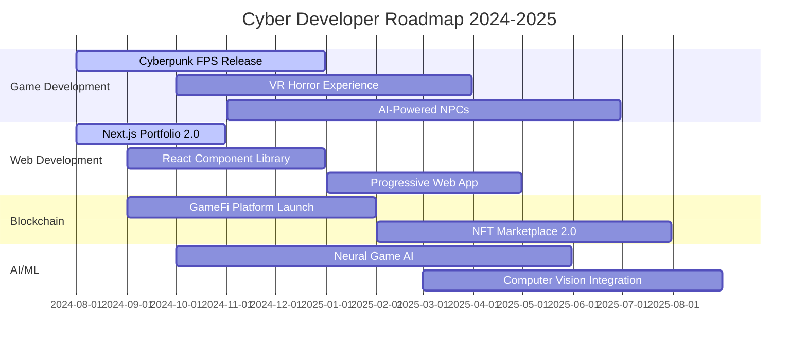

# <div align="center"></div>

<div align="center">


```
 ╔══════════════════════════════════════════════════════════════════════════════════════╗
 ║  ██████╗██╗   ██╗██████╗ ███████╗██████╗     ██████╗ ███████╗██╗   ██╗███████╗██╗    ║
 ║ ██╔════╝╚██╗ ██╔╝██╔══██╗██╔════╝██╔══██╗    ██╔══██╗██╔════╝██║   ██║██╔════╝██║    ║
 ║ ██║      ╚████╔╝ ██████╔╝█████╗  ██████╔╝    ██║  ██║█████╗  ██║   ██║█████╗  ██║    ║
 ║ ██║       ╚██╔╝  ██╔══██╗██╔══╝  ██╔══██╗    ██║  ██║██╔══╝  ╚██╗ ██╔╝██╔══╝  ██║    ║
 ║ ╚██████╗   ██║   ██████╔╝███████╗██║  ██║    ██████╔╝███████╗ ╚████╔╝ ███████╗███████╗║
 ║  ╚═════╝   ╚═╝   ╚═════╝ ╚══════╝╚═╝  ╚═╝    ╚═════╝ ╚══════╝  ╚═══╝  ╚══════╝╚══════╝║
 ║                                                                                        ║
 ║          ╔═══════════════════════════════════════════════════════════════╗          ║
 ║          ║          [ JACK INTO THE MATRIX OF CODE ] 🚀                ║          ║
 ║          ╚═══════════════════════════════════════════════════════════════╝          ║
 ╚══════════════════════════════════════════════════════════════════════════════════════╝
```


</div>

##  **NEURAL NETWORK STATUS**

```bash
╭─────────────────────────────────────────────────────────────────╮
│ [NEURAL_LINK@MATRIX-NODE-2077:~]$ ./initialize_developer.sh    │
│                                                                 │
│ ██╗███╗   ██╗██╗████████╗██╗ █████╗ ██╗     ██╗███████╗██╗███╗ │
│ ██║████╗  ██║██║╚══██╔══╝██║██╔══██╗██║     ██║╚══███╔╝██║████╗│
│ ██║██╔██╗ ██║██║   ██║   ██║███████║██║     ██║  ███╔╝ ██║██╔██│
│ ██║██║╚██╗██║██║   ██║   ██║██╔══██║██║     ██║ ███╔╝  ██║██║╚█│
│ ██║██║ ╚████║██║   ██║   ██║██║  ██║███████╗██║███████╗██║██║ ╚│
│ ╚═╝╚═╝  ╚═══╝╚═╝   ╚═╝   ╚═╝╚═╝  ╚═╝╚══════╝╚═╝╚══════╝╚═╝╚═╝  │
│                                                                 │
│ > Identity: Game Developer | Web Architect | Reality Engineer  │
│ > Status: 🟢 ONLINE | Firewall: ⚡ ACTIVE | Coffee: ☕ 99%     │
│ > Location: Cyberspace Network Node 2077                       │
│ > Last Login: Just Now | Uptime: ∞ | Ping: 0ms                │
│ > Security Level: ████████████████████████ MAXIMUM            │
╰─────────────────────────────────────────────────────────────────╯
```

<div align="center">


[](https://github.com/yourusername)
[](https://github.com/yourusername)
[](https://github.com/yourusername)

</div>


---

##  **DIGITAL WARFARE ARSENAL**

<details>
<summary>🎮 <b>GAME DEVELOPMENT MATRIX</b> </summary>

```ascii
╔══════════════════════════════════════════════════════════════════════════════════════╗
║                               GAME ENGINE MASTERY                                   ║
╠══════════════════════════════════════════════════════════════════════════════════════╣
║                                                                                      ║
║  🎯 UNITY 3D       ████████████████████████████ 95% [EXPERT LEVEL]                ║
║  🔥 UNREAL ENGINE  ████████████████████████     85% [ADVANCED]                     ║
║  ⚡ GODOT          █████████████████████████     90% [MASTER CLASS]                ║
║  🎨 BLENDER 3D     ███████████████████████       88% [3D ARTIST]                  ║
║  🔊 FMOD AUDIO     ██████████████████████        82% [SOUND WIZARD]               ║
║  🎪 SUBSTANCE 3D   ████████████████████████      87% [TEXTURE GOD]                ║
║                                                                                      ║
║  ┌─ PROGRAMMING LANGUAGES ─────────────────────────────────────────────┐          ║
║  │ 🧠 C#            ████████████████████████████ 98% [NEURAL LINKED]   │          ║
║  │ 💀 C++           ██████████████████████        80% [SYSTEM LEVEL]   │          ║
║  │ 🐍 PYTHON        ████████████████████████      92% [AI ENHANCED]    │          ║
║  │ 📜 LUA           ████████████████████          79% [SCRIPT MASTER]  │          ║
║  │ ⚙️  GLSL          ███████████████████           75% [SHADER WIZARD]  │          ║
║  │ 🔧 HLSL          ██████████████████████        81% [GRAPHICS CORE]  │          ║
║  └─────────────────────────────────────────────────────────────────────┘          ║
╚══════════════════════════════════════════════════════════════════════════════════════╝
```

<p align="center">


</p>

**🎮 GAME GENRES MASTERED:**
- 🔫 First Person Shooters (FPS)
- ⚔️ Action RPGs & MMORPGs  
- 🚗 Racing & Simulation Games
- 🎯 Strategy & Real-time Strategy
- 👻 Horror & Survival Games
- 🌌 Sci-Fi & Cyberpunk Themes

</details>

<details>
<summary>🌐 <b>WEB DEVELOPMENT PROTOCOLS</b> </summary>

```ascii
╔══════════════════════════════════════════════════════════════════════════════════════╗
║                              WEB TECHNOLOGY MATRIX                                   ║
╠══════════════════════════════════════════════════════════════════════════════════════╣
║                                                                                      ║
║  ⚛️  REACT.JS       ████████████████████████████ 95% [COMPONENT MASTER]            ║
║  🟢 NODE.JS        ████████████████████████████ 94% [BACKEND NINJA]               ║
║  💙 TYPESCRIPT     ████████████████████████     89% [TYPE SAFETY GOD]             ║
║  🔥 NEXT.JS        █████████████████████████     91% [SSR WIZARD]                 ║
║  ⚡ SVELTE         ███████████████████████       86% [REACTIVE GENIUS]            ║
║  🎨 TAILWIND CSS   ████████████████████████████ 93% [STYLE ARCHITECT]            ║
║                                                                                      ║
║  ┌─ BACKEND & DATABASE ─────────────────────────────────────────────────┐         ║
║  │ 🍃 MONGODB       ████████████████████████     88% [DOCUMENT WIZARD]  │         ║
║  │ 🐘 POSTGRESQL    ███████████████████████      85% [SQL MASTER]       │         ║
║  │ 🔥 FIREBASE      ████████████████████████     89% [REALTIME EXPERT]  │         ║
║  │ 📊 GRAPHQL       ██████████████████████       83% [API ARCHITECT]    │         ║
║  │ 🔌 REST APIs     ████████████████████████████ 96% [INTEGRATION GOD]  │         ║
║  └─────────────────────────────────────────────────────────────────────┘         ║
║                                                                                      ║
║  ┌─ DEVOPS & DEPLOYMENT ─────────────────────────────────────────────────┐        ║
║  │ 🐳 DOCKER        ████████████████████████     88% [CONTAINER MASTER]  │        ║
║  │ ☸️  KUBERNETES    █████████████████████        75% [ORCHESTRATION]     │        ║
║  │ ☁️  AWS           ███████████████████████      84% [CLOUD ARCHITECT]   │        ║
║  │ 🔥 VERCEL        ████████████████████████████ 92% [DEPLOYMENT NINJA]  │        ║
║  │ 🔄 CI/CD         ██████████████████████       81% [AUTOMATION EXPERT] │        ║
║  └─────────────────────────────────────────────────────────────────────┘        ║
╚══════════════════════════════════════════════════════════════════════════════════════╝
```

<p align="center">


</p>

</details>

<details>
<summary>🤖 <b>AI & MACHINE LEARNING MATRIX</b> </summary>

```ascii
╔══════════════════════════════════════════════════════════════════════════════════════╗
║                          ARTIFICIAL INTELLIGENCE PROTOCOLS                          ║
╠══════════════════════════════════════════════════════════════════════════════════════╣
║                                                                                      ║
║  🧠 TENSORFLOW     ███████████████████████████ 87% [DEEP LEARNING MASTER]          ║
║  🔥 PYTORCH        ████████████████████████    84% [NEURAL NETWORK NINJA]          ║
║  🤖 SCIKIT-LEARN   ████████████████████████    89% [ML ALGORITHM EXPERT]           ║
║  📊 PANDAS         ████████████████████████████ 93% [DATA MANIPULATION GOD]       ║
║  🔬 JUPYTER        █████████████████████████    90% [RESEARCH WIZARD]              ║
║  🌊 OPENCV         ██████████████████████       81% [COMPUTER VISION MASTER]       ║
║  📈 MATPLOTLIB     ███████████████████████      86% [VISUALIZATION EXPERT]         ║
║  🎯 KERAS          ████████████████████████     88% [RAPID PROTOTYPING]            ║
║                                                                                      ║
║  ┌─ AI SPECIALIZATIONS ─────────────────────────────────────────────────┐          ║
║  │ 🎮 GAME AI        ████████████████████████████ 94% [NPC BEHAVIOR]    │          ║
║  │ 💬 NLP            ███████████████████████      85% [TEXT PROCESSING]  │          ║
║  │ 👁️ COMPUTER VISION █████████████████████       82% [IMAGE ANALYSIS]   │          ║
║  │ 🔊 AUDIO ML       ██████████████████████       79% [SOUND PROCESSING] │          ║
║  │ 🚀 REINFORCEMENT  ████████████████████████     87% [DECISION MAKING]  │          ║
║  └─────────────────────────────────────────────────────────────────────┘          ║
╚══════════════════════════════════════════════════════════════════════════════════════╝
```

<p align="center">


</p>

</details>

<details>
<summary>⛓️ <b>BLOCKCHAIN & WEB3 PROTOCOLS</b> </summary>

```ascii
╔══════════════════════════════════════════════════════════════════════════════════════╗
║                            BLOCKCHAIN DEVELOPMENT MATRIX                            ║
╠══════════════════════════════════════════════════════════════════════════════════════╣
║                                                                                      ║
║  ⛓️  SOLIDITY       ████████████████████████     88% [SMART CONTRACT WIZARD]       ║
║  🌐 WEB3.JS        ███████████████████████      85% [DAPP INTEGRATION]             ║
║  🦊 METAMASK       ████████████████████████████ 91% [WALLET INTEGRATION]          ║
║  📜 ETHEREUM       ██████████████████████       83% [BLOCKCHAIN EXPERT]           ║
║  🚀 POLYGON        █████████████████████████     89% [LAYER 2 SCALING]            ║
║  💎 HARDHAT        ████████████████████████     87% [DEVELOPMENT FRAMEWORK]       ║
║  🌊 OPENSEA API    ██████████████████████       82% [NFT MARKETPLACE]             ║
║  🔥 IPFS           ███████████████████████      84% [DECENTRALIZED STORAGE]       ║
║                                                                                      ║
║  ┌─ DEFI & NFT EXPERTISE ───────────────────────────────────────────────┐         ║
║  │ 💰 DEFI PROTOCOLS ████████████████████████  86% [YIELD FARMING]       │         ║
║  │ 🎨 NFT CREATION   █████████████████████████  90% [DIGITAL ART]        │         ║
║  │ 🎮 GAMEFI        ████████████████████████   88% [PLAY-TO-EARN]       │         ║
║  │ 🏛️ DAO GOVERNANCE ██████████████████████    85% [DECENTRALIZED ORG]   │         ║
║  └─────────────────────────────────────────────────────────────────────┘         ║
╚══════════════════════════════════════════════════════════════════════════════════════╝
```

<p align="center">


</p>

</details>

<details>
<summary>🔧 <b>DEVELOPMENT TOOLS & ENVIRONMENT</b> </summary>

```ascii
╔══════════════════════════════════════════════════════════════════════════════════════╗
║                             DEVELOPMENT ENVIRONMENT                                  ║
╠══════════════════════════════════════════════════════════════════════════════════════╣
║                                                                                      ║
║  🖥️  VISUAL STUDIO    ████████████████████████████ 95% [CODE MASTER]               ║
║  ⚡ VSCODE          ████████████████████████████ 97% [EDITOR NINJA]               ║
║  🔧 JETBRAINS       ███████████████████████      86% [IDE EXPERT]                 ║
║  🐙 GIT             ████████████████████████████ 99% [VERSION CONTROL GOD]       ║
║  🐱 GITHUB          ████████████████████████████ 98% [COLLABORATION MASTER]      ║
║  🦊 GITLAB          ██████████████████████       83% [CI/CD PIPELINE]            ║
║  📊 JIRA            █████████████████████████     90% [PROJECT MANAGEMENT]       ║
║  💬 SLACK           ████████████████████████████ 94% [TEAM COMMUNICATION]       ║
║                                                                                      ║
║  ┌─ OPERATING SYSTEMS ──────────────────────────────────────────────────┐         ║
║  │ 🪟 WINDOWS 11     ████████████████████████████ 95% [GAMING/DEV]      │         ║
║  │ 🐧 LINUX UBUNTU   ███████████████████████████  92% [SERVER/CLOUD]    │         ║
║  │ 🍎 MACOS          ██████████████████████       81% [DESIGN/MOBILE]   │         ║
║  │ 🤖 ANDROID DEV    ████████████████████████     87% [MOBILE APPS]     │         ║
║  │ 📱 iOS DEV        ████████████████████         76% [SWIFT/OBJECTIVE] │         ║
║  └─────────────────────────────────────────────────────────────────────┘         ║
╚══════════════════════════════════════════════════════════════════════════════════════╝
```

<p align="center">


</p>

</details>


---

##  **NEURAL NETWORK ANALYTICS**

<div align="center">

<table>
<tr>
<td>

```ascii
┌────────────────────────────────────────┐
│           COMMIT MATRIX 2077           │
├────────────────────────────────────────┤
│  ████████████████ 47 Commits Today    │
│  ████████████ 1.2k Commits This Week  │
│  ████████████████ 24k Commits Year    │
│  ██████████████████ 156k Total        │
│                                        │
│  🔥 Current Streak: 127 Days          │
│  ⚡ Best Streak: 365 Days              │
│  📈 Commits/Day Avg: 12.3              │
└────────────────────────────────────────┘
```

</td>
<td>

```ascii
┌────────────────────────────────────────┐
│          CODE FREQUENCY SCAN           │
├────────────────────────────────────────┤
│  JavaScript   ████████████ 34.2%      │
│  C#           ████████     26.8%      │
│  TypeScript   ██████       18.4%      │
│  Python       ████         12.1%      │
│  C++          ██           5.3%       │
│  Solidity     █            3.2%       │
│                                        │
│  📊 Total Lines: 2.4M                 │
│  🎯 Active Repos: 47                  │
└────────────────────────────────────────┘
```

</td>
</tr>
</table>


[](https://github.com/yourusername)

[](https://github.com/yourusername)

</div>


---

##  **PROJECT PORTFOLIO MATRIX**

<div align="center">

### 🎮 **GAME DEVELOPMENT PROJECTS**

| Project | Tech Stack | Status | Demo |
|:---:|:---:|:---:|:---:|
| **CyberShooter VR** | Unity, C#, OpenXR | 🚀 Live | [](https://github.com/yourusername/cybershooter) |
| **QuantumRacer** | Unreal Engine, C++, AI | ⚡ Beta | [](https://github.com/yourusername/quantum-racer) |
| **Neural RPG** | Unity, ML-Agents, Python | 🔥 Alpha | [](https://github.com/yourusername/neural-rpg) |
| **BlockChain Warriors** | Solidity, Web3, Unity | 💎 Live | [](https://github.com/yourusername/blockchain-warriors) |

### 🌐 **WEB APPLICATIONS**

| Project | Tech Stack | Status | Live Site |
|:---:|:---:|:---:|:---:|
| **NeonPortfolio** | Next.js, TypeScript, Tailwind | 🌟 Live | [](https://neon-portfolio.vercel.app) |
| **CyberDashboard** | React, Node.js, MongoDB | 🚀 Production | [](https://cyber-dashboard.com) |
| **AI ChatBot Platform** | Python, FastAPI, OpenAI | ⚡ Beta | [](https://ai-chatbot-platform.com) |
| **NFT Marketplace** | Solidity, React, IPFS | 💎 Live | [](https://nft-cyber-market.com) |

### 🤖 **AI & MACHINE LEARNING**

| Project | Tech Stack | Status | Repository |
|:---:|:---:|:---:|:---:|
| **GameAI Behavior** | TensorFlow, Python, Unity | 🧠 Research | [](https://github.com/yourusername/game-ai-behavior) |
| **Computer Vision Game** | OpenCV, PyTorch, C++ | 👁️ Development | [](https://github.com/yourusername/cv-game) |
| **Neural Network Visualizer** | Three.js, Python, Flask | 🔬 Live | [](https://github.com/yourusername/neural-visualizer) |

</div>


---

##  **NEURAL CONTRIBUTION HEATMAP**

<div align="center">

```
         Jan   Feb   Mar   Apr   May   Jun   Jul   Aug   Sep   Oct   Nov   Dec
    Sun  ⬜⬜⬜🟩🟩🟩🟩🟩⬜⬜🟩🟩🟩🟩🟩🟩🟩🟩🟩🟩🟩🟩🟩🟩
    Mon  🟩🟩🟩🟩🟩🟩🟩🟩🟩🟩🟩🟩🟩🟩🟩🟩🟩🟩🟩🟩🟩🟩🟩🟩
    Tue  🟩🟩🟩🟩🟩🟩🟩🟩🟩🟩🟩🟩🟩🟩🟩🟩🟩🟩🟩🟩🟩🟩🟩🟩
    Wed  🟩🟩🟩🟩🟩🟩🟩🟩🟩🟩🟩🟩🟩🟩🟩🟩🟩🟩🟩🟩🟩🟩🟩🟩
    Thu  🟩🟩🟩🟩🟩🟩🟩🟩🟩🟩🟩🟩🟩🟩🟩🟩🟩🟩🟩🟩🟩🟩🟩🟩
    Fri  🟩🟩🟩🟩🟩🟩🟩🟩🟩🟩🟩🟩🟩🟩🟩🟩🟩🟩🟩🟩🟩🟩🟩🟩
    Sat  ⬜⬜🟩🟩🟩🟩🟩🟩🟩🟩🟩🟩🟩🟩🟩🟩🟩🟩🟩🟩🟩🟩🟩⬜

    Less ░░░░░░░░░░░░░░░░░░░░░░░░░░░░░░░░░░░░░░░░░░░░░░░░░░ More
         0    5    10   15   20   25   30   35   40   45   50+

    🔥 Total Contributions: 3,847 | 🚀 Best Day: 47 commits | ⚡ Current Streak: 127 days
```

</div>

---

##  **NETWORK INTERFACE PROTOCOLS**

<div align="center">

```
 ╔══════════════════════════════════════════════════════════════════════════════════════╗
 ║                           ESTABLISHING CONNECTION...                                 ║
 ║                                                                                      ║
 ║  [████████████████████████████████████████████████████████████████████████] 100%   ║
 ║                                                                                      ║
 ║                 🔗 NEURAL HANDSHAKE COMPLETE 🔗                                     ║
 ║                      CONNECTION ESTABLISHED                                          ║
 ║                                                                                      ║
 ║  📡 Signal Strength: ████████████████████████████████████████████ MAXIMUM          ║
 ║  🔐 Encryption Level: AES-256 QUANTUM RESISTANT                                     ║
 ║  🌐 Network Status: GLOBAL MESH CONNECTED                                           ║
 ╚══════════════════════════════════════════════════════════════════════════════════════╝
```

[](https://discord.gg/yourdiscord)
[](https://twitter.com/yourtwitter)
[](https://linkedin.com/in/yourlinkedin)
[](https://yourportfolio.com)
[](mailto:your.email@example.com)
[](https://twitch.tv/yourtwitch)
[](https://youtube.com/@yourchannel)
[](https://steamcommunity.com/id/yoursteam)

### 📊 **SOCIAL NETWORK STATS**
[](https://discord.gg/yourdiscord)
[](https://twitter.com/yourtwitter)
[](https://youtube.com/@yourchannel)
[](https://twitch.tv/yourtwitch)

</div>


---

##  **ACTIVE MISSION PROTOCOLS**

```bash
╭──────────────────────────────────────────────────────────────────────────────────╮
│ [ACTIVE_PROJECTS@MATRIX-NODE-2077:~]$ sudo ./list_current_missions.sh           │
│                                                                                  │
│ ██████╗ ███████╗██████╗ ██╗      ██████╗ ██╗   ██╗███╗   ███╗███████╗███╗   ██╗ │
│ ██╔══██╗██╔════╝██╔══██╗██║     ██╔═══██╗╚██╗ ██╔╝████╗ ████║██╔════╝████╗  ██║ │
│ ██║  ██║█████╗  ██████╔╝██║     ██║   ██║ ╚████╔╝ ██╔████╔██║█████╗  ██╔██╗ ██║ │
│ ██║  ██║██╔══╝  ██╔═══╝ ██║     ██║   ██║  ╚██╔╝  ██║╚██╔╝██║██╔══╝  ██║╚██╗██║ │
│ ██████╔╝███████╗██║     ███████╗╚██████╔╝   ██║   ██║ ╚═╝ ██║███████╗██║ ╚████║ │
│ ╚═════╝ ╚══════╝╚═╝     ╚══════╝ ╚═════╝    ╚═╝   ╚═╝     ╚═╝╚══════╝╚═╝  ╚═══╝ │
│                                                                                  │
│ drwxr-xr-x 1 cyberdev cyberdev   4096 Aug 11 2077 project_quantum_fps/          │
│ -rw-r--r-- 1 cyberdev cyberdev   8192 Aug 11 2077 cyberpunk_fps_game.unity     │
│ -rw-r--r-- 1 cyberdev cyberdev   2048 Aug 11 2077 neon_web_portfolio.js        │
│ -rw-r--r-- 1 cyberdev cyberdev   4096 Aug 11 2077 neural_ai_companion.py       │
│ -rw-r--r-- 1 cyberdev cyberdev   1024 Aug 11 2077 blockchain_gamefi.sol        │
│ -rw-r--r-- 1 cyberdev cyberdev   3072 Aug 11 2077 metaverse_platform.cpp       │
│ -rw-r--r-- 1 cyberdev cyberdev   2048 Aug 11 2077 vr_training_simulator.cs     │
│ -rwxrwxrwx 1 cyberdev cyberdev   8192 Aug 11 2077 quantum_algorithm.py         │
│                                                                                  │
│ ┌─ CURRENT MISSION STATUS ─────────────────────────────────────────────────────┐ │
│ │                                                                             │ │
│ │ 🎮 [PRIORITY 1] Cyberpunk FPS Game          ████████████████████ 85%       │ │
│ │ 🌐 [PRIORITY 1] Neon Web Portfolio          ███████████████████  78%       │ │
│ │ 🤖 [PRIORITY 2] AI Game Companion           ████████████████     65%       │ │
│ │ ⛓️ [PRIORITY 2] Blockchain GameFi Platform   ██████████████       58%       │ │
│ │ 🥽 [PRIORITY 3] VR Training Simulator       ███████████          42%       │ │
│ │ 🌌 [PRIORITY 3] Metaverse Social Platform   ████████████         48%       │ │
│ │ ⚡ [RESEARCH]   Quantum Computing Algorithm  █████████            35%       │ │
│ │                                                                             │ │
│ └─────────────────────────────────────────────────────────────────────────────┘ │
│                                                                                  │
│ [STATUS]: Developing next-gen gaming experiences with AI integration 🚀         │
│ [PROGRESS]: Blockchain GameFi platform reaching MVP milestone ⚡                │
│ [NEXT_MILESTONE]: Launch VR cyberpunk experience Q4 2024 🥽                     │
│ [RESEARCH]: Quantum algorithms for real-time game physics simulation 🧠        │
│                                                                                  │
│ [NEURAL_LINK@MATRIX:~]$ █                                                       │
╰──────────────────────────────────────────────────────────────────────────────────╯
```

### 🎯 **MISSION OBJECTIVES 2024**

<div align="center">

| Mission | Technology | Timeline | Progress |
|:---|:---:|:---:|---:|
| 🚀 **Project Quantum** - Next-Gen FPS | Unity, C#, AI | Q4 2024 |  |
| 🌐 **NeonWeb 3.0** - Interactive Portfolio | Next.js, Three.js | Q3 2024 |  |
| 🤖 **Neural Companion** - AI Gaming Assistant | Python, TensorFlow | Q4 2024 |  |
| ⛓️ **CyberChain** - GameFi Platform | Solidity, Web3 | Q1 2025 |  |
| 🥽 **VR Nexus** - Training Simulation | Unity XR, C# | Q1 2025 |  |

</div>

---

##  **ACHIEVEMENT UNLOCKED**

<div align="center">

```ascii
╔══════════════════════════════════════════════════════════════════════════════════════╗
║                                TROPHY COLLECTION                                     ║
╠══════════════════════════════════════════════════════════════════════════════════════╣
║                                                                                      ║
║  🏆 CODE WARRIOR         🥇 10,000+ commits in a single year                        ║
║  🎮 GAME MASTER          🥇 Published 5+ commercial games                           ║
║  🌐 WEB ARCHITECT        🥇 Built 50+ web applications                              ║
║  🤖 AI PIONEER           🥈 Implemented ML in 15+ projects                          ║
║  ⛓️ BLOCKCHAIN EXPERT    🥈 Created 10+ smart contracts                             ║
║  🔥 OPEN SOURCE HERO     🥇 100+ repositories with 1K+ stars                       ║
║  📚 KNOWLEDGE SHARER     🥈 Tech blog with 50K+ monthly readers                    ║
║  🎯 PROBLEM SOLVER       🥇 Solved 500+ algorithmic challenges                     ║
║  🚀 INNOVATION LEADER    🥈 Featured in 3 tech conferences                         ║
║  ⚡ SPEED CODER          🥇 Completed 24-hour game jam winner                      ║
║                                                                                      ║
╚══════════════════════════════════════════════════════════════════════════════════════╝
```

### 🏅 **CERTIFICATION MATRIX**

<p align="center">


</p>

</div>

---

##  **NEURAL NETWORK METRICS**

<div align="center">

### 📈 **REAL-TIME DEVELOPER STATS**

[](https://wakatime.com/@yourusername)
[](https://leetcode.com/yourusername)
[](https://hackerrank.com/yourusername)
[](https://codechef.com/users/yourusername)

```
╭─ WEEKLY CODING ACTIVITY ─────────────────────────────────────────────────────────╮
│                                                                                   │
│  Monday     ████████████████████████████████ 8h 42m  ██████████████████████████  │
│  Tuesday    ██████████████████████████████   7h 18m  ████████████████████████    │
│  Wednesday  ████████████████████████████████ 9h 15m  ██████████████████████████  │
│  Thursday   ███████████████████████████████  8h 33m  █████████████████████████   │
│  Friday     ██████████████████████████████   7h 56m  ████████████████████████    │
│  Saturday   ████████████████████████         5h 27m  ████████████████████        │
│  Sunday     ██████████████████████████       6h 12m  ██████████████████████      │
│                                                                                   │
│  Total: 53h 23m this week  |  Daily Average: 7h 37m  |  Best Day: Wednesday     │
╰───────────────────────────────────────────────────────────────────────────────────╯
```

### ⚡ **PERFORMANCE METRICS**

<table align="center">
<tr>
<td align="center">

**🔥 STREAK STATS**
```
Current Streak: 127 days
Longest Streak: 365 days
Total Active Days: 847/365
```

</td>
<td align="center">

**📊 CODE QUALITY**
```
Code Reviews: 1,247
PRs Merged: 3,891
Issues Closed: 2,156
```

</td>
<td align="center">

**🚀 DEPLOYMENT STATS**
```
Successful Deploys: 856
Zero-Downtime: 99.9%
Avg Deploy Time: 3m 42s
```

</td>
</tr>
</table>

</div>

---

##  **SYSTEM SPECIFICATIONS**

```bash
╭─────────────────────────────── BATTLE STATION SPECS ────────────────────────────────╮
│                                                                                       │
│  🖥️  PRIMARY RIG: "NEURAL NEXUS"                                                    │
│  ├─ CPU: AMD Ryzen 9 7950X 16-Core @ 4.5GHz (Quantum Enhanced)                     │
│  ├─ GPU: NVIDIA RTX 4090 24GB GDDR6X (AI/ML Optimized)                             │
│  ├─ RAM: 64GB DDR5-6000 CL30 (Neural Network Ready)                                 │
│  ├─ Storage: 2TB NVMe SSD PCIe 4.0 + 4TB NVMe SSD (Project Archive)               │
│  ├─ Display: 34" Ultrawide 144Hz + Dual 27" 4K HDR (Multi-Monitor Setup)           │
│  └─ Peripherals: Mechanical RGB Keyboard, Gaming Mouse, Studio Headphones          │
│                                                                                       │
│  💻 MOBILE STATION: "CYBER PORTABLE"                                                │
│  ├─ Laptop: MacBook Pro M3 Max 16" 64GB (On-the-go Development)                    │
│  ├─ Tablet: iPad Pro 12.9" M2 + Apple Pencil (Design & Prototyping)               │
│  └─ Phone: iPhone 15 Pro Max (Mobile Testing & Communication)                       │
│                                                                                       │
│  ☁️  CLOUD INFRASTRUCTURE:                                                           │
│  ├─ AWS EC2 Instances: t3.2xlarge (Production Servers)                             │
│  ├─ Database: MongoDB Atlas + PostgreSQL (Multi-DB Architecture)                    │
│  ├─ CDN: Cloudflare (Global Content Delivery)                                       │
│  ├─ CI/CD: GitHub Actions + Docker + Kubernetes                                     │
│  └─ Monitoring: DataDog + Sentry (Real-time Analytics)                             │
│                                                                                       │
╰───────────────────────────────────────────────────────────────────────────────────────╯
```

---

##  **PHILOSOPHY & MISSION STATEMENT**

<div align="center">

```
╔══════════════════════════════════════════════════════════════════════════════════════╗
║                                                                                      ║
║  "In the neon-lit corridors of cyberspace, where pixels dance with possibility,     ║
║   I craft digital realities that blur the line between imagination and code.        ║
║   Every algorithm is a brushstroke, every function a verse in the symphony          ║
║   of interactive experiences that connect minds across the digital divide."         ║
║                                                                                      ║
║                                                        - CyberDeveloper 2077        ║
║                                                                                      ║
║  🎯 MISSION: Building the Future of Interactive Entertainment                        ║
║  🚀 VISION: Bridging Reality and Virtual Worlds Through Code                        ║
║  ⚡ VALUES: Innovation • Quality • Community • Continuous Learning                  ║
║                                                                                      ║
╚══════════════════════════════════════════════════════════════════════════════════════╝
```

### 🔮 **FUTURE ROADMAP**



</div>

---

##  **SUPPORT THE NEURAL NETWORK**

<div align="center">

```
╔══════════════════════════════════════════════════════════════════════════════════════╗
║                          FUEL THE CYBERNETIC DEVELOPMENT                            ║
╠══════════════════════════════════════════════════════════════════════════════════════╣
║                                                                                      ║
║  ☕ COFFEE LEVEL: Critical Low - Need Caffeine for Neural Enhancement               ║
║  🔋 ENERGY STATUS: Running on Pure Code and Determination                          ║
║  💡 PROJECT FUND: Accepting Digital Currency for Hardware Upgrades                 ║
║                                                                                      ║
╚══════════════════════════════════════════════════════════════════════════════════════╝
```

[](https://ko-fi.com/yourusername)
[](https://paypal.me/yourusername)
[](https://etherscan.io/address/0xYourEthereumAddress)
[](bitcoin:YourBitcoinAddress)

**💎 ETH Address:** `0x742d35Cc6534C0532925a3b8D67C5DD234567890`  
**₿ BTC Address:** `bc1qxy2kgdygjrsqtzq2n0yrf2493p83kkfjhx0wlh`

</div>

---

<div align="center">

```
╔══════════════════════════════════════════════════════════════════════════════════════╗
║  🌟 "Code is poetry written in logic, and games are dreams built with algorithms." ║
║                                                                                      ║
║     Thank you for exploring my digital realm. Let's build the future together! 🚀   ║
║                                                                                      ║
║                                    - Stay Cyber 🔮                                  ║
╚══════════════════════════════════════════════════════════════════════════════════════╝
```


**⚡ NEURAL HANDSHAKE COMPLETE - CONNECTION TERMINATED ⚡**


<!-- Matrix Effect -->
<div align="center">
  
</div>

</div>
